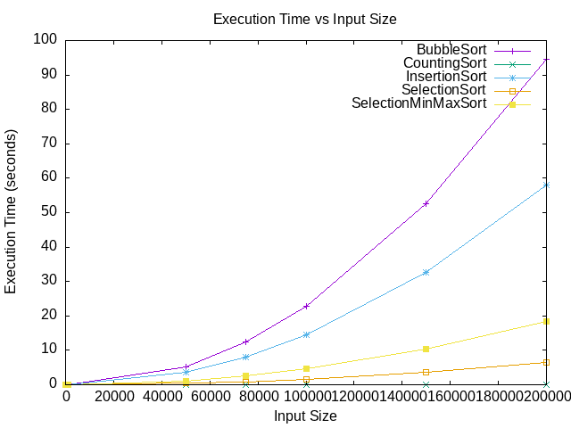

Zmodyfikować jedną wybraną implementację i dodać instrukcje zliczające dominujące operacje.
Obliczyć złożoność obliczeniową pesymistyczną, średnią i optymistyczną oraz w miarę możliwości
pesymistycznej. Sprawdzić dla losowych danych i tablicy posortowanej, czy liczba wykonanych oper-
acji dominujących zgadza się oszacowaniami.

SelectionSort dla 5 elementowego zbioru.
1. Pesymistycznie [7,1,2,3,4,5,6]
Comparisions: 6 Swaps: 6
  Swaps: O(n-1)
  Comparisions: O(n-1)
